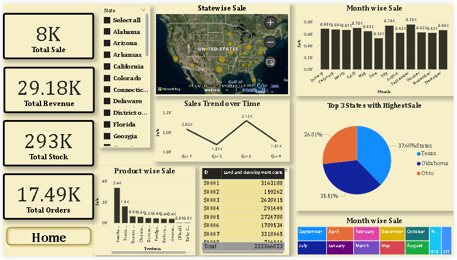

# 🛒 DMart Sales Analysis Dashboard 

## 📌 Project Overview

This project presents a comprehensive **DMart Sales Analysis Dashboard** built using **Power BI**.
The dashboard provides insights into sales performance, product trends, store efficiency, and profitability.

It helps in understanding:

* Which products and categories perform best
* Sales trends over time
* Store-wise performance
* Cost vs Profit analysis

---

## 🎯 Objectives

* Analyze sales data to identify key trends
* Track store performance across different locations
* Identify top-selling products and categories
* Compare sales with operational costs
* Build an interactive dashboard for decision-making

---

## 📊 Dashboard Features

* 📈 Sales Trend Analysis (Time-based)
* 🏬 Store Performance Analysis
* 🛍️ Product Category Insights
* 💰 Profit & Cost Analysis
* 🔝 Top Selling Products
* 🌍 Location-based Sales Insights
* 🎛️ Interactive Filters (Slicers)

---

## 📂 Dataset Information

The project uses multiple datasets:

* **Sales Data** – Transaction-level sales details
* **Product Data** – Product name, category, brand, price
* **Store Cost Data** – Operating cost per store
* **Store Location Data** – City and store details

---

## 🧮 Key Metrics (KPIs)

* Total Sales
* Total Profit
* Total Orders
* Average Sales per Store

---

## 🛠️ Tools & Technologies Used

* Power BI
* Microsoft Excel / CSV Dataset
* Data Visualization Techniques

---

## 🖼️ Dashboard Preview

### 🔹 Home Page


### 🔹 Sales Analysis



---

## 📈 Key Insights

* Grocery and Dairy categories contribute the highest sales
* Certain stores generate higher revenue but also incur higher costs
* Top 10 products significantly impact total revenue
* Sales show seasonal trends over time

---

## 📁 Project Structure

```
dmart-sales-dashboard
│
├── DMart_Sales_Dashboard.pbix
├── data/
│   └── dataset.csv
├── images/
│   └── dashboard screenshots
└── README.md
```

---

## 🚀 How to Use

1. Download the `.pbix` file
2. Open using **Power BI Desktop**
3. Explore different dashboard pages
4. Use filters for interactive analysis

---

## 📌 Future Improvements

* Add real-time data integration
* Include forecasting using ML models
* Enhance UI with advanced visuals

---
